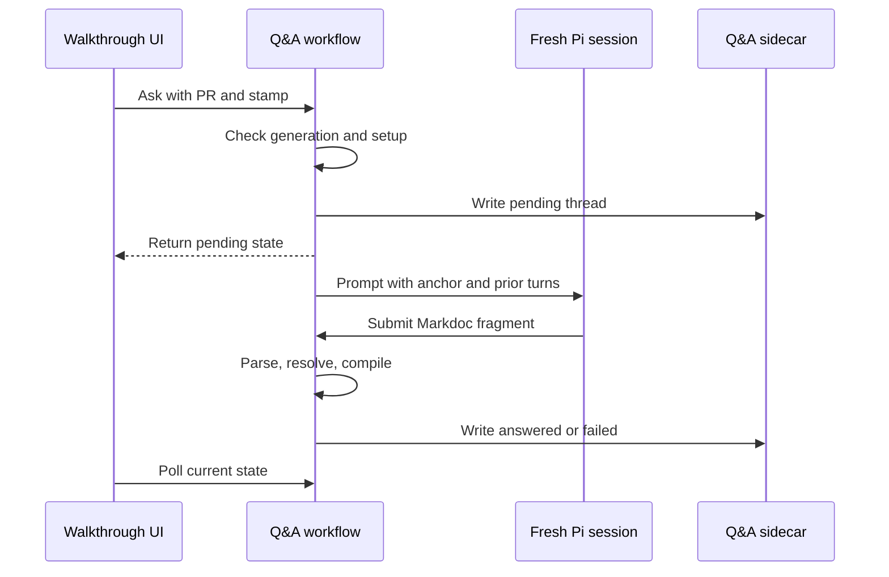



This change adds live clarification threads to served walkthroughs. A reviewer selects text, asks a question, and receives a compiled Markdoc answer in a section-bound thread. Follow-up questions reuse the earlier turns as prompt context.

The main review constraint is trust. The selected text, question, earlier answers, walkthrough, and repository are all untrusted. The server binds each thread to the displayed PR and commit, runs each answer in a fresh pinned inspection session, validates the answer before storage, and persists only compiled `Block` values. Static exports do not enable this feature because the Q&A provider marks it unavailable outside served mode.

The change also centralizes provider and model setup. Generation, live clarification, `balade agent setup`, and `balade agent logout` now use one model manager.





The browser sends the walkthrough path, the displayed PR and commit, and either a new anchor or an existing thread ID. The server verifies the generation before setup, after setup, and after repository context preparation. It does not persist the question if any check finds a newer generation.



After validation, the server writes a pending thread under a one-permit lock. It then forks the clarification worker in the server scope. This makes the pending state visible immediately while generation continues in the background.

The worker gives Pi the pinned commit, base commit, changed files, source walkthrough, anchor, prior turns, and current question. Changed instruction files use the `omit-changed` policy. On success, the server appends one compiled turn. On any worker failure or interruption, it retains the question and earlier turns in a failed thread.





The submit tool validates inside the active Pi turn. It returns exact diagnostics for correction. It permits at most two repair attempts and stops early when the diagnostics do not change. Each call to `answer` creates and releases its own in-memory inspection session.





A server restart cannot resume an in-memory worker. On the first read for a generation, the workflow converts every stored pending thread to failed. The UI permits a follow-up on that failed thread, so the question and prior answers remain available for retry.







The contract represents a thread as a strict state union.


Contains completed turns plus exactly one active question.
Contains at least one completed turn. Each answer is a non-empty array of canonical `Block` values.
Keeps completed turns, the refused or interrupted question, and its failure time.
Binds the complete sidecar state and every ask request to the displayed walkthrough generation.


Thread and turn IDs must be UUID v4 values. New questions carry a section ID and selected excerpt. Follow-ups carry an existing thread ID instead of a new anchor.



The store mirrors the walkthrough path under `.balade/` and adds the `.qa.json` suffix. Writes use a temporary file and rename it into place. Reads reject a copied sidecar whose serialized walkthrough owner does not match the requested path.



The path guard rejects absolute and climbing paths. It resolves each existing directory and file component, so a symbolic link cannot redirect state outside the repository-owned state tree.







In served mode, selecting up to 2,000 normalized characters inside one walkthrough section shows the ask action. A selection that crosses sections or starts in the Q&A panel is rejected. The action opens a side panel with the selected excerpt and question form.



The provider polls Q&A state every 1.5 seconds. It pauses effective reconciliation while a request is active and uses an epoch to prevent an older poll from replacing newly submitted state. A payload change aborts the old lifecycle and resets the panel and local state.



Each section shows an exchange count when threads exist. The panel renders answer blocks through the existing `BlockView`, including code, widgets, pseudo-code fences, and Mermaid diagrams. A persistent sidebar lists answered, pending, and failed threads with localized status labels.


The browser checks agent readiness only when the reviewer opens a Q&A surface. Opening a walkthrough does not start Pi setup.




The model manager serializes setup and logout. `ensure` reuses a valid saved preference. If none is available, it starts terminal setup and stores the selected model. Generation calls the same manager directly, so generation and Q&A share provider and model policy.



The new CLI surface supports explicit setup filters and removal of all stored Balade agent logins.







Clarification answers reuse the walkthrough parser inside a synthetic section. The parser rejects frontmatter, an outer fence, empty answers, unavailable presets, and tags that could create sections, groups, or file browsers. Compilation then uses the normal block compiler and resolves referenced code files against the pinned context.



The HTTP edge requires JSON for questions, limits the body to 64 KiB, keeps the existing loopback host guard, and maps stale generation requests to HTTP 412. Provider and credential details never enter the browser contract; `/api/agent` returns only `ready` or `setup-required`.




Runs the workflow through fixture repositories, real context resolution, and file sidecars while replacing only the Pi port.
Uses a faux provider to drive the real submit tool and active Pi session.
Checks the clarification-only restrictions around the canonical walkthrough grammar.
Exercises the served React state transitions with controlled fetch responses.
Covers setup, selection, cancellation, preference failures, and logout through injected ports.





















