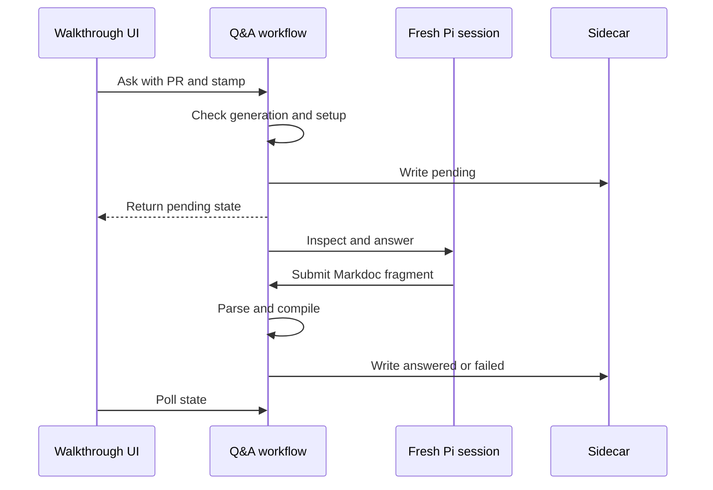



This change adds **live clarification threads** to served walkthroughs. A reviewer selects a passage, asks a question, and receives an answer that can use the same compiled blocks as the walkthrough. Follow-up questions keep the thread context. Pending, answered, and failed threads remain available in the sidebar.

The main review constraint is the trust boundary. The browser binds each request to the displayed PR and commit. The server checks that generation, runs a fresh read-only Pi session, validates the submitted Markdoc fragment, and persists compiled `Block` values instead of model-produced HTML. Static exports do not enable Q&A.

The change also moves provider and model selection into one shared manager. Generation, first-use Q&A setup, `balade agent setup`, and `balade agent logout` now use the same configuration policy.





The browser sends either a new anchor or an existing thread ID. Every request also carries the PR number and stamp that the page displays. The thread contract makes each lifecycle state explicit: `pending` carries one active question, `answered` carries at least one completed turn, and `failed` preserves the refused or interrupted question.



The server checks the generation three times: before model setup, after setup, and after it prepares the walkthrough source and repository context. A stale page therefore cannot persist a question against a newer walkthrough. Setup cancellation also happens before the pending state is written.



After these checks, the server writes `pending` while it holds the workflow semaphore. It then forks a worker in the server scope and returns the pending state to the browser. The worker receives the pinned commit, base commit, changed-file summary, walkthrough source, anchor, completed turns, and current question. Changed repository instruction files are always omitted from clarification sessions.

The pending write and worker handoff are uninterruptible. The worker installs an exit handler that converts an error or interruption to `failed`. A process crash cannot run that handler, so the first read after restart converts abandoned pending entries to failed once for that walkthrough generation.







Each question creates a scoped Pi session. Generation and clarification share one sandbox assembler, so both use the pinned snapshot, in-memory session policy, and six Balade-owned inspection tools. Each workflow adds only its own terminating submit tool.



The clarification submit tool validates while the Pi turn is active. A rejected answer returns the exact diagnostics as untrusted tool data. The same session can submit a complete replacement. Repair stops after two changing attempts or as soon as the diagnostic set repeats.



The validator wraps the answer in a synthetic section and uses the normal walkthrough parser. It rejects frontmatter, an outer fence, empty content, unavailable presets, and whole-document `section`, `group`, or `files` tags. It then calls the canonical block compiler. Code references that were not in the initial context trigger another resolution at the pinned generation before compilation.






Only compiled `Block` arrays reach answered state. The PR adds no Q&A-specific HTML sink.






The selection control accepts normalized text from one walkthrough section and caps the excerpt at 2,000 characters. It rejects cross-section selections and selections inside the Q&A panel. Each section can show an exchange count, while the sidebar gives every thread an independent route back to its panel.



The React provider polls every 1.5 seconds only in served mode. It pauses effective reconciliation during a POST and increments an epoch before submission. An older poll cannot replace the pending state returned by that POST. A payload change aborts the previous lifecycle and resets Q&A state, which prevents an old response from entering a new walkthrough generation.



Opening a Q&A surface checks only `ready` versus `setup-required`; opening the walkthrough itself does not start Pi. The panel renders answer blocks through the existing `BlockView`, including pinned code, structured widgets, pseudo-code, and Mermaid.



Review and Q&A state now mirror the complete walkthrough path below `.balade/`. The suffix is appended to the complete name, so extensionless paths and same-basename walkthroughs stay distinct. Writes use a same-directory temporary file and rename, and reads verify the serialized walkthrough owner.



Before file access, the store rejects uncontained paths. It checks every existing directory and file against its expected canonical path. A symlink cannot redirect a sidecar outside the state tree. Concurrent directory creation ignores only `AlreadyExists`, then runs the same canonical-path and directory-type checks.




The review sidecar location also changes from a basename-only file to the full mirrored walkthrough path. There is no legacy lookup. Existing local review marks at the old location will not load after this change.


The shared model manager serializes setup, explicit configuration, and logout. `ensure` rechecks the saved preference after it acquires the permit, so concurrent first questions cannot open competing terminal setup flows. The new CLI commands let reviewers configure this state in advance or remove all stored Balade provider credentials.








The tests use fixture repositories, real context resolution, and real sidecar files while replacing only the clarifier and model-manager ports.
A faux Pi provider drives the real `submit_answer` tool and scoped session.
These cases verify the clarification restrictions around the canonical parser.
Controlled browser fetch responses exercise the React state transitions.
The file-store tests cover the new mirrored layout and atomic initialization boundary.
Injected author and terminal ports verify setup policy without module mocking.


















