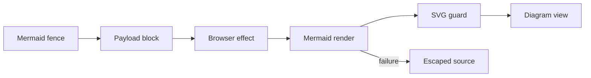



This change lets a walkthrough use a top-level Markdown fence tagged `mermaid`. The compiler keeps the diagram at its position between prose blocks and adds a `mermaid` variant to the payload contract. Other fenced code still produces the existing unsupported-fence warning.

The main review constraint is trust. Diagram source comes from the pull request. Mermaid converts it to SVG, and the app injects that SVG into the page. The implementation therefore limits Mermaid configuration and sanitizes the returned SVG at the injection boundary. It also updates the authoring package: Mermaid is for control flow or interactions, while collapsed code evidence is limited to substantial Mechanism explanations.





The compiler recognizes only a top-level fence whose normalized language is `mermaid`. It flushes the prose before the fence, emits one diagram block, and then resumes prose compilation. This preserves the authored order. A nested or differently tagged fence remains in Markdown flow and receives the unsupported-fence diagnostic.

The payload contract carries the untrusted source in an explicit `mermaid` block variant that both the CLI and app must handle.

The browser loads Mermaid on first use. Its fixed configuration uses strict mode, disables HTML labels at each relevant switch, and protects those switches from diagram-level directives. After rendering, the sink guard removes scripts and anchors. It also removes event handlers and non-fragment URL attributes, while preserving same-document SVG references.









The widget has three visible states. Server rendering and the first browser render show a pending placeholder. A successful render injects only the guarded SVG. Empty source or a render failure shows the original source as escaped text with a localized note.



The browser effect does not call Mermaid for empty source. Each non-empty diagram receives an app-generated, selector-safe id before rendering.



The authoring guidance now keeps collapsed code ranges exceptional. Authors can collapse evidence only below a substantial explanation in the Mechanism group. Other code ranges stay open. Mermaid fences are suggested when a flowchart or interaction diagram explains logic better than prose; the existing grid `diagram` block remains for relation maps with change status and section references.





The tests cover both the compiler seam and the browser sink. The real-Mermaid tests are important because they first prove that strict mode still returns an anchor, then prove that the sink guard removes it.


The compiler tests distinguish the new top-level exception from existing fenced-code behavior.
These tests send adversarial source through the installed Mermaid renderer before applying the app guard.
The widget tests cover the final injection seam and the user-visible failure path.









