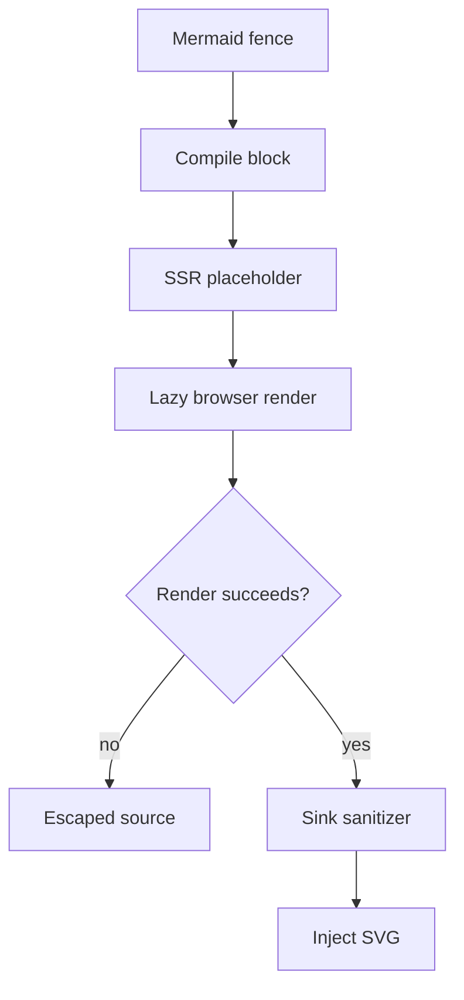



This change adds Mermaid diagrams as a new walkthrough block. A top-level `mermaid` fence now crosses the CLI payload contract and renders in the browser. Other fence languages remain unsupported. The important review constraint is that diagram source comes from an unreviewed pull request, while Mermaid returns SVG markup for an HTML injection sink.

The change also revises the authoring package. It encourages Mermaid for branching logic and interactions, reserves the grid diagram for relation maps, and limits `collapsed=true` to evidence below a substantial Mechanism explanation.


The PR description names authoring package 1.12.0, but the pinned implementation and its documentation set version 1.13.0. Review this version choice as an explicit divergence from the stated release claim.






The compiler handles only a top-level fence whose normalized language is `mermaid`. It flushes preceding Markdown, emits the diagram at that exact block position, and then resumes Markdown collection. Nested fences, such as a fence in a blockquote, still follow the unsupported-fence path. The payload carries only a `mermaid` discriminator and the source string.

In the app, server rendering stops at a pending placeholder. The browser effect creates a selector-safe ID and loads Mermaid on first use. Mermaid initializes once with strict mode, SVG text labels, and secure configuration keys that diagram directives cannot replace. A successful render still does not go directly to React. The sink guard parses the returned markup inertly, removes scripts and event handlers, unwraps anchors, and removes non-fragment URL attributes. Only then does the widget inject the SVG. A render failure changes the state to unavailable and sends the original source through React's escaped text path.

The compiler tests prove that the new block preserves its position. They also prove that ordinary and blockquoted fences retain the unsupported diagnostic.

The renderer disables HTML labels at each relevant Mermaid switch and protects those settings from source-level directives. It also uses a dynamic import, so served pages load the dependency only when a diagram needs it.



Strict mode is not the final trust decision. `sanitizeDiagramSvg` guards the injection seam itself and keeps only same-document URL references used by SVG markers and symbols.



The React hook owns the browser-only state transition. Empty source bypasses Mermaid, and any typed render failure becomes the unavailable state after logging.







A drawn diagram uses the sanitized HTML sink. Pending diagrams show a fixed placeholder. Failed or empty diagrams show the source in a `pre` element with localized chrome instead of leaving an empty section.





The package teaches Mermaid as an optional visual tool in a Mechanism explanation. It also places collapsed evidence in that explanation rather than making collapse the default reading state.





The tests cover the compiler, the real third-party renderer, the widget seam, and server rendering.


This verifies the new block boundary without weakening the old diagnostic.
These cases run the pinned Mermaid dependency under jsdom rather than replacing it with a module mock.
An injected renderer exercises success and failure while retaining the production sanitizer in the path.
This protects the browser-only lazy-loading boundary.









